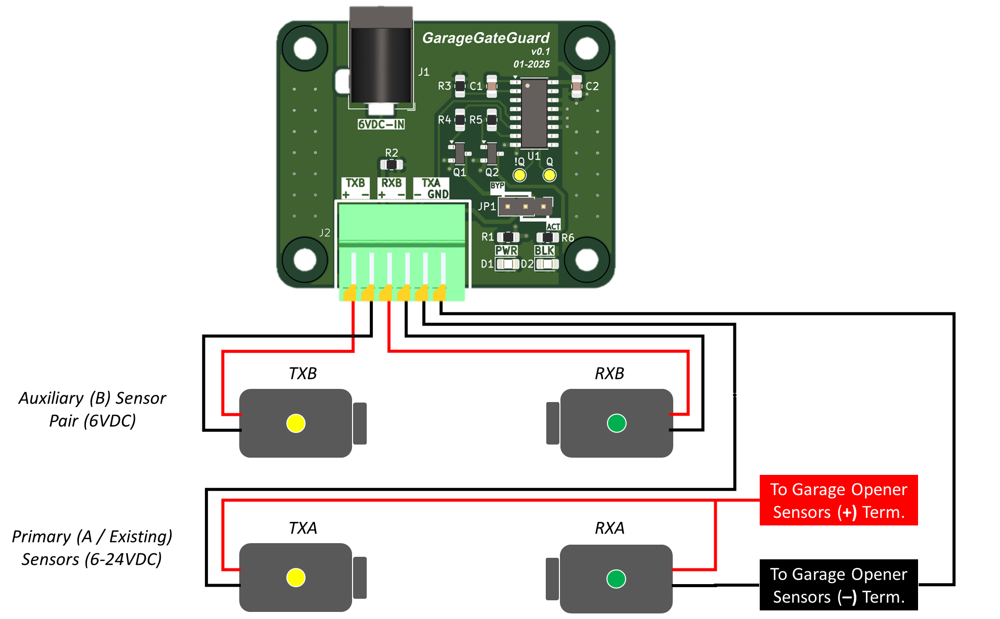

# GarageGateGuard
## About
This project contains KiCad 8.0 files and all supporting information needed for you to build your own *GarageGateGuard* PCB to protect the liftgate of your vehicle from having the garage door accidentally closed on it. The *GarageGateGuard* PCB enables you to add an auxiliary pair of infrared sensors to your garage door opening. When the auxiliary sensors are blocked (e.g., by your car's liftgate), power to the infrared transmitter of your opener's primary sensor pair is interrupted--emulating a blockage condition and stopping your opener from closing the door. Regular safety operation of your primary sensors is still maintained.

The PCB is built around a circuit presented by [@0033mer](https://youtube.com/@0033mer?si=xY0d-Dty4cxYaAsI) in a his "Garage Door Safety Sensors" [video](https://youtu.be/CdpjvQUqqL8?si=sJUc2Y0D_GqsPqLC) where he shows how to decode the output of the infrared receiver to determine if the beam from the transmitter is being received or not. In this PCB design, the decoded signal is used to control an NMOS switch which is wired up to control the ON-state of the grage opener's primary infrared transmitter. Full details can be seen in the included schematic and wiring diagram.

## Operation
For the auxiliary sensors, the PCB is designed to use a pair of 6V "universal" garage door safety sensors and has been validated using [these sensors](https://a.co/d/aTHSjK9) from Amazon. In theory the name-brand sensors from LiftMaster, Chamberlain, etc., should also work, but none of these have been tested. Because the system's "interface" with the existing grage door opener is so simple (i.e., just interrupting the ground connection to the opener's existing infrared transmitter), it should work with virtually any opener that has safety sensors powered by DC voltage under 40V (this is the Drain-Source voltage limit of the NMOS). The PCB reqires 6VDC supplied via J1 (see BOM for recommended power supply) and the PWR LED will illuminate to indicate the board is powered-on. When the auxiliary sensors (TXB and RXB) are not within line-of-sight of each other, the BLK (i.e., "blocked") LED will also illuminate. For the PCB to function as designed, a pin-jumper (see BOM) must be placed in the ACT (i.e., "active") position on JP1. If the PCB were to fail, or begin to malfunction, original operation of your garage door could be quickly restored by simply moving the jumper to the BYP (i.e., "bypass") position.

